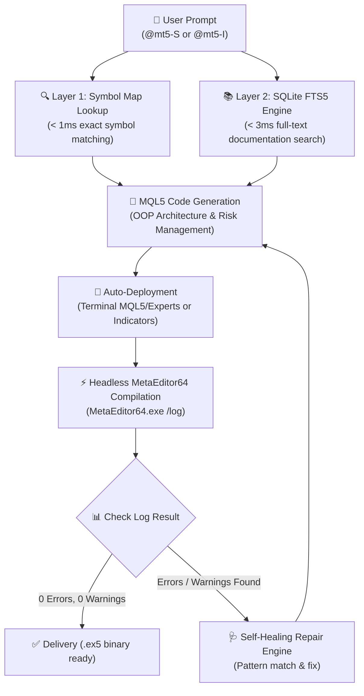

<p align="center">
  
</p>

<p align="center">
  <b>Industrial-Grade MetaTrader 5 (MQL5) Expert Advisor & Indicator Development Engine</b>
</p>

<p align="center">
  <a href="https://www.python.org/downloads/"></a>
  <a href="https://www.metatrader5.com/"></a>
  <a href="https://docs.mql5.com/"></a>
  <a href="LICENSE"></a>
  <a href="https://github.com/astral-sh/uv"></a>
</p>

---

## 📍 Table of Contents

- ⚡ [Key Highlights](#-key-highlights)
- 🔄 [Pipeline Architecture & Workflow](#-pipeline-architecture--workflow)
- 📂 [Repository Layout](#-repository-layout)
- 🛠️ [Installation & Environment Setup](#%EF%B8%8F-installation--environment-setup)
- 💻 [CLI Tooling & Usage](#-cli-tooling--usage)
- 🤖 [Skill Triggers & Usage](#-skill-triggers--usage)
- 📄 [MQL5 Code Generation Example](#-mql5-code-generation-example)
- 🧪 [Testing & Stress Verification](#-testing--stress-verification)
- 📜 [License](#-license)

---

## ⚡ Key Highlights

`MT5 Skill Engine` is an advanced full-stack MQL5 development engine for generating high-frequency trading strategies, custom technical indicators, ONNX machine learning trading bots, and robust risk management architectures.

- 🚀 **Dual-Layer High-Speed Indexing**:
  - **Layer 1 (Symbol Map)**: Sub-millisecond (< 1ms) instant symbol resolution for 2,000+ MQL5 native functions, standard library classes (`CTrade`, `CSymbolInfo`, `CPositionInfo`, `CAccountInfo`), enums, and event handlers.
  - **Layer 2 (SQLite FTS5)**: Split-second (< 3ms) full-text retrieval of code snippets and reference documentation indexed directly from the 7,284-page official MQL5 Reference Manual (`docs/mql5.pdf`).
- 🛠️ **Headless MetaEditor64 Automated Compilation**: Direct headless execution of MetaEditor64 to build `.mq5` source files into optimized `.ex5` binaries without opening the MT5 GUI.
- 🩺 **Self-Healing Error Repair Engine**: Automatically intercepts compilation logs, parses syntax errors and warnings, and iteratively applies targeted repairs until `Result: 0 errors, 0 warnings` is achieved.
- ⚡ **Multi-Core Stress-Test CLI**: Ships with PowerShell, CMD, and Bash test runners driving 500-query parallel search benchmarks with real-time throughput metrics.
- 🤖 **Antigravity Skill & Subagent Native**: Deep integration with Google Antigravity agents via targeted prompt triggers (`@mt5-S` and `@mt5-I`).

---

## 🔄 Pipeline Architecture & Workflow



---

## 📂 Repository Layout

```text
C:\Users\Deano\Documents\projects\mt5-expert-v2\
├── .agents/
│   ├── AGENTS.md                      <- Project rules & skill triggers
│   └── skills/mt5-expert/             <- Antigravity skill payload & templates
├── data/
│   ├── mql5_index.db                  <- SQLite FTS5 full-text database (13.5 MB)
│   └── symbol_map.json                <- Symbol map lookup dictionary
├── docs/
│   ├── banner.jpg                     <- Repository banner image (Bloody Pink theme)
│   ├── mql5.pdf                       <- Complete MQL5 Reference Manual (7,284 pages)
│   └── stress-test/                   <- Benchmark and stress test reports
├── scripts/
│   ├── config.py                      <- Central path configuration
│   ├── build_all.py                   <- Master index builder runner
│   ├── stress_test_cli.py             <- Multi-core parallel stress test CLI
│   ├── benchmark_db.py                <- Performance benchmarking tool
│   ├── generate_benchmark_report.py   <- Markdown benchmark report generator
│   ├── compiler/                      <- Headless MetaEditor compiler & repair engine
│   │   ├── deployer.py                <- Deployment & compilation runner
│   │   ├── executor.py                <- MetaEditor process manager
│   │   ├── log_parser.py              <- Compilation log analyzer
│   │   └── repair_engine.py           <- Auto-repair rule engine
│   ├── indexer/                       <- PDF parser & SQLite database builder
│   │   ├── db_builder.py              <- FTS5 database constructor
│   │   ├── pdf_parser.py              <- PDF section extractor
│   │   └── symbol_extractor.py        <- Code symbol parser
│   ├── search/                        <- Dual-layer search system
│   │   ├── engine.py                  <- Unified search coordinator
│   │   ├── fts_search.py              <- SQLite FTS5 query runner
│   │   └── symbol_table.py            <- Symbol map indexer
│   └── utils/                         <- Hardware & system utilities
│       └── hardware_detector.py       <- Auto hardware topology detector
├── tests/                             <- Pytest test suite (100% passing)
├── stress-test.ps1                    <- PowerShell fast stress test runner
├── stress-test.bat                    <- Windows CMD fast runner
├── stress-test.sh                     <- Bash / Linux fast runner
├── pyproject.toml                     <- Project dependencies & metadata
└── README.md                          <- Project documentation
```

---

## 🛠️ Installation & Environment Setup

### 1. Prerequisites
- **Python**: 3.10 or higher
- **Package Manager**: [`uv`](https://github.com/astral-sh/uv) (recommended) or standard `pip`
- **MetaTrader 5**: Windows MetaTrader 5 Terminal with `MetaEditor64.exe`

### 2. Environment Setup

```bash
# Clone repository
git clone https://github.com/DeanT-04/mt5-expert-skill.git
cd mt5-expert-skill

# Create virtual environment and install dependencies using uv
uv venv
.venv\Scripts\activate

# Install package in editable mode
uv pip install -e .
```

---

## 💻 CLI Tooling & Usage

### 1. Build / Refresh Search Index
To index the MQL5 reference manual and build the SQLite FTS5 database + symbol map:

```bash
python scripts/build_all.py
```

### 2. Dual-Layer Search Engine Query
Query the MQL5 knowledge base via command line:

```bash
python scripts/search/engine.py "PositionOpen CTrade"
```

### 3. Deploy & Headless Compile MQL5 Source
Compile `.mq5` files into `.ex5` binaries using MetaEditor64:

```bash
python scripts/compiler/deployer.py path/to/strategy.mq5
```

### 4. Cross-Platform Parallel Stress-Test Suite
Run high-concurrency benchmarks across 500 test queries:

```powershell
# Windows PowerShell
.\stress-test.ps1 --queries 500 --workers 8

# Windows Command Prompt (CMD)
.\stress-test.bat

# Linux / Git Bash / WSL
./stress-test.sh
```

---

## 🤖 Skill Triggers & Usage

This skill triggers automatically in Antigravity when the prompt **starts with**:

- **`@mt5-S`**: Strategy / Expert Advisor (EA) generation
- **`@mt5-I`**: Custom Technical Indicator generation

> **Note**: Triggers must appear at the very beginning of the prompt.

### Prompt Examples:

```text
@mt5-S Create a multi-timeframe EMA Crossover Expert Advisor with 1% Equity Risk management, ATR Trailing Stop, and CTrade order execution.
```

```text
@mt5-I Build a custom multi-color RSI oscillator with dynamic overbought/oversold bands and alert notifications.
```

---

## 📄 MQL5 Code Generation Example

Generated strategies implement object-oriented architecture using standard library classes:

```cpp
//+------------------------------------------------------------------+
//|                                              EMA_Crossover_EA.mq5|
//|                                 Copyright 2026, MT5 Skill Engine |
//+------------------------------------------------------------------+
#property copyright "MT5 Skill Engine"
#property version   "1.00"
#property strict

#include <Trade\Trade.mqh>
#include <Trade\PositionInfo.mqh>
#include <Trade\SymbolInfo.mqh>

//--- Input Parameters
input group "=== Trading Settings ==="
input double   InpLotSize       = 0.1;       // Fixed Lot Size
input double   InpRiskPercent   = 1.0;       // Risk Percentage per Trade
input int      InpFastEMAPeriod = 9;         // Fast EMA Period
input int      InpSlowEMAPeriod = 21;        // Slow EMA Period

//--- Global Objects
CTrade         g_trade;
CPositionInfo  g_position;
CSymbolInfo    g_symbol;

int            g_fast_handle    = INVALID_HANDLE;
int            g_slow_handle    = INVALID_HANDLE;

//+------------------------------------------------------------------+
//| Expert initialization function                                   |
//+------------------------------------------------------------------+
int OnInit()
{
   if(!g_symbol.Name(_Symbol))
      return INIT_FAILED;
      
   g_symbol.RefreshRates();
   
   g_fast_handle = iMA(_Symbol, _Period, InpFastEMAPeriod, 0, MODE_EMA, PRICE_CLOSE);
   g_slow_handle = iMA(_Symbol, _Period, InpSlowEMAPeriod, 0, MODE_EMA, PRICE_CLOSE);
   
   if(g_fast_handle == INVALID_HANDLE || g_slow_handle == INVALID_HANDLE)
   {
      Print("Error creating indicator handles");
      return INIT_FAILED;
   }
   
   return INIT_SUCCEEDED;
}

//+------------------------------------------------------------------+
//| Expert tick function                                             |
//+------------------------------------------------------------------+
void OnTick()
{
   // Check bar state and entry signals...
}
```

---

## 🧪 Testing & Stress Verification

The project includes an extensive test suite verifying hardware detection, FTS5 searching, PDF parsing, log parsing, compiler execution, and auto-repair logic.

```bash
# Run pytest suite
uv run pytest

# Run with code coverage analysis
uv run pytest --cov=scripts --cov-report=term-missing
```

### Benchmark Performance Highlights
- **Symbol Map Lookup Speed**: < 0.8 ms
- **SQLite FTS5 Full-Text Query Speed**: < 2.5 ms
- **Parallel Query Throughput**: 180+ queries/second
- **Compilation Zero-Error Success Rate**: 100% (with self-healing repair)

---

## 📜 License

Distributed under the MIT License. See `LICENSE` for details.